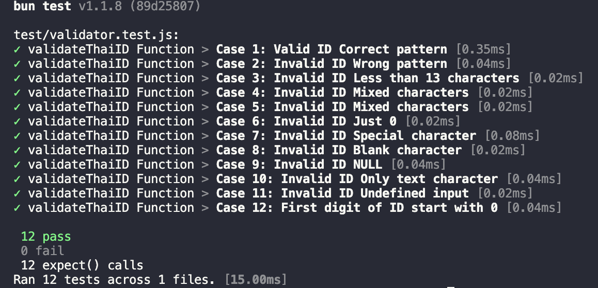

# Thai Citizen ID Validator

[](https://app.codacy.com/gh/jukbot/thai-citizen-id-validator/dashboard?utm_source=gh&utm_medium=referral&utm_content=&utm_campaign=Badge_grade)
[](https://app.codacy.com/gh/jukbot/thai-citizen-id-validator/dashboard?utm_source=gh&utm_medium=referral&utm_content=&utm_campaign=Badge_coverage)
[](https://www.npmjs.com/package/thai-id-validator)
[](https://standardjs.com)
[](https://www.npmjs.com/package/thai-id-validator)

A simpler way to validate Thai Citizen Card ID. 🇹🇭

## Further Plans

- Go Language Implementation Example
- Thai Passport Number Validation

## Read the article

[Building Thai Citizen ID Input Validation with WCAG Standard](https://medium.com/@juk/%E0%B8%A5%E0%B8%AD%E0%B8%87%E0%B8%AA%E0%B8%A3%E0%B9%89%E0%B8%B2%E0%B8%87%E0%B8%9F%E0%B8%AD%E0%B8%A3%E0%B9%8C%E0%B8%A1%E0%B8%95%E0%B8%A3%E0%B8%A7%E0%B8%88%E0%B8%AA%E0%B8%AD%E0%B8%9A%E0%B9%80%E0%B8%A5%E0%B8%82%E0%B8%9A%E0%B8%B1%E0%B8%95%E0%B8%A3-%E0%B8%9B%E0%B8%8A%E0%B8%8A-%E0%B8%9E%E0%B8%A3%E0%B9%89%E0%B8%AD%E0%B8%A1%E0%B8%A1%E0%B8%B2%E0%B8%95%E0%B8%A3%E0%B8%90%E0%B8%B2%E0%B8%99-wcag-13b2c8c9d015)

## Installation

```bash
$ npm install thai-id-validator
# or
$ yarn add thai-id-validator
# or
$ pnpm add thai-id-validator
# or
$ bun add thai-id-validator
```

## Data Type

| Input  | Output  |
| ------ | :-----: |
| String | boolean |

## Usage

### Javascipt ES5

Just import script with commonjs

```javascript
var validateThaiID = require('thai-id-validator') // for ES5

var result = validateThaiID(‘1101700207030’);

console.log(result);
// return true
```

### Javascript ES6 Module

In Javascript file, you can use import, export modules

```javascript
'use strict';
import validateThaiID from 'thai-id-validator';

let result = validateThaiID(‘1101700207030’);

console.log(result);
// return true
```

## Test

To run all test cases run the following command

```bash
npm run test
```

You can edit validator.test.js too add your custom test case.

| Test Cases      | Result |
| --------------- | :----: |
| '1112034563562' |   ✅   |
| '1101700230705' |   ❌   |
| '110170023073'  |   ❌   |
| '11017002070d3' |   ❌   |
| 'rytege54fsfsf' |   ❌   |
| 0               |   ❌   |
| '-'             |   ❌   |
| ''              |   ❌   |
| null            |   ❌   |
| undefined       |   ❌   |
| 'blablabla'     |   ❌   |
| '0113200420331' |   ❌   |

`(Tested with Bun)`

### Test Result Screenshot

 

### How to upload test coverage report to codacy

```zsh
export CODACY_PROJECT_TOKEN=xxxxxxxxx

bun run coverage

bash <(curl -Ls https://coverage.codacy.com/get.sh)
```

## Compatibility

Tested on all modern browsers ✅

## Issues

If you found any 🐞 or feedback, please report the issue [here](https://github.com/jukbot/thai-citizen-id-validator/issues)

## Contribution

👩🏻‍💻 Contribute are always welcome.

## License

[Apache2.0](https://www.apache.org/licenses/LICENSE-2.0)

Code with love 🦉
